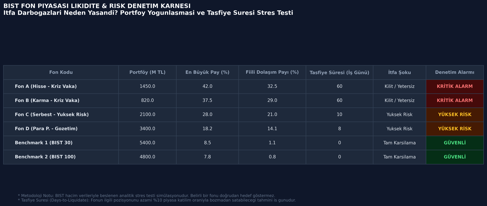
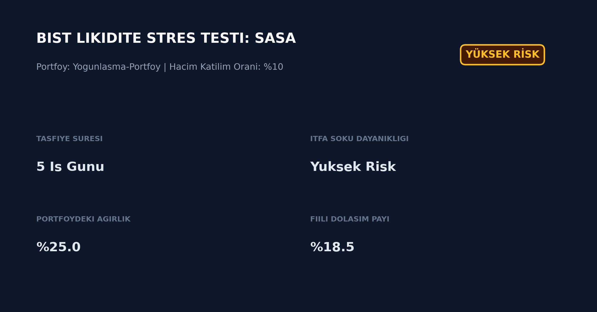
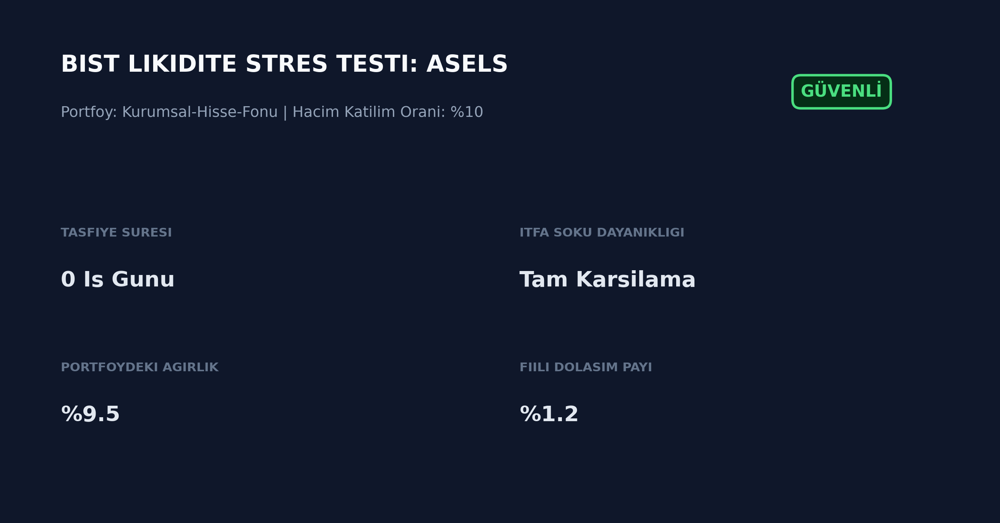

# BIST Mutual Funds Liquidity & Concentration Risk Engine

Borsa Istanbul (BIST) ve TEFAS ekosistemindeki fonlar için portfoy yogunlasmasi, fiili dolasim payi ve gerceklesmis islem hacimlerine dayali tasfiye suresi (Days-to-Liquidate) analitiği sunan nicel risk denetim motoru.



---

## Calismanin Kapsami ve Amaci

Yatirim fonlarinda kriz donemlerinde karsilasilan itfa (redemption run) kilitlenmeleri, yalnizca varlik fiyatlarinin gerilemesinden degil; piyasa derinligi yetersiz tahtalarda biriken buyuk pozisyonlarin taban fiyati tetiklemeden nakde donusturulememesinden kaynaklanir.

Bu analitik motor:
1. Portfoylerin tekil hisse veya bagli grup senedi bazindaki konsantrasyonunu olcer.
2. Pozisyon buyuklugunu Borsa Istanbul son 30 gunluk ortalama gunluk islem hacmine (ADTV) oranlayarak, tahtayi bozmadan cikis yapabilmek icin gereken is gunu sayisini (Days-to-Liquidate - DTL) hesaplar.
3. Ani itfa soklarina karsi fonlarin nakde donusum profilini denetleyen gorsel karne ve hisse bazli risk kartlari uretir.

---

## Metodoloji

### 1. Tasfiye Suresi (Days-to-Liquidate - DTL)
Fonun elindeki hisse senedi pozisyonunu piyasaya darbe vurmadan (market impact olusturmadan) satabilmesi icin, seanslik hacmin azami %10'u ile sinirli satis yaptigi varsayilir:

$$\text{Tasfiye Suresi (Gun)} = \frac{\text{Pozisyon Buyuklugu (TL)}}{\text{ADTV (30 Gunluk Hacim)} \times 0.10}$$

### 2. Yogunlasma ve Dolasim Riski Esikleri
* **Portfoydeki Agirlik > %20:** Konsantrasyon riski siniri.
* **Fiili Dolasim Payi > %20:** Fonun, sirketin serbest dolasimdaki paylarinin buyuk bolumunu kilitleyerek karsi taraf likidite riski olusturmasi.

---

## Vaka Analizi ve Karsilastirmali Stres Testi

Modelin pratik calisma mekanizmasini gostermek adina farkli likidite katmanlarindan iki BIST hissesi uzerinde ornek stres testi calistirilmistir:

### Ornek 1: SASA (Yogunlasma & Likidite Sikismasi)
* **Pozisyon:** 1.2 Milyar TL portfoyun %25'i SASA hissesinde.
* **Sonuc:** BIST gercek hacimlerine gore piyasayi bozmadan cikis icin gereken tasfiye suresi **5 is gunu** olarak hesaplanmis ve model **YUKSEK RISK** uyarisi vermistir.



### Ornek 2: ASELS (Yuksek Kurumsal Likidite & Benchmark)
* **Pozisyon:** 1.2 Milyar TL portfoyun %9.5'i ASELSAN hissesinde.
* **Sonuc:** Derin kurumsal tahta ve yuksek gunluk hacim sayesinde tasfiye suresi **0 is gunu** (ayni seans ici cikis) cikmis ve model **GUVENLI** rozeti uretmistir.



---

## Kurulum ve Calistirma

### Gereksinimler
```bash
python3 -m pip install -r requirements.txt

